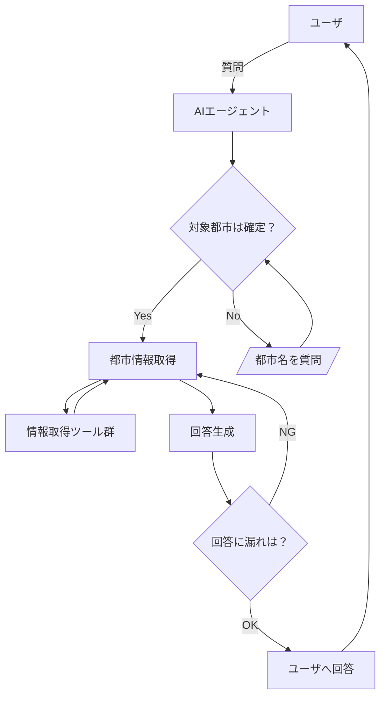

# AI Agent 設計

```mermaid
graph TB
    %% User Interaction
    U[ユーザ] -->|質問| AG[AIエージェント]

    %% City determination
    AG --> DetermineCity{対象都市は確定？}
    DetermineCity -- Yes --> GatherInfo[都市情報取得]
    DetermineCity -- No --> AskCity[/都市名を質問/]
    AskCity --> DetermineCity

    %% Information retrieval
    GatherInfo --> Tools[情報取得ツール群]
    Tools --> GatherInfo

    %% Answer generation
    GatherInfo --> Compose[回答生成]
    Compose --> Validate{回答に漏れは？}
    Validate -- OK --> Response[ユーザへ回答]
    Validate -- NG --> GatherInfo

    %% Response
    Response --> U
```
