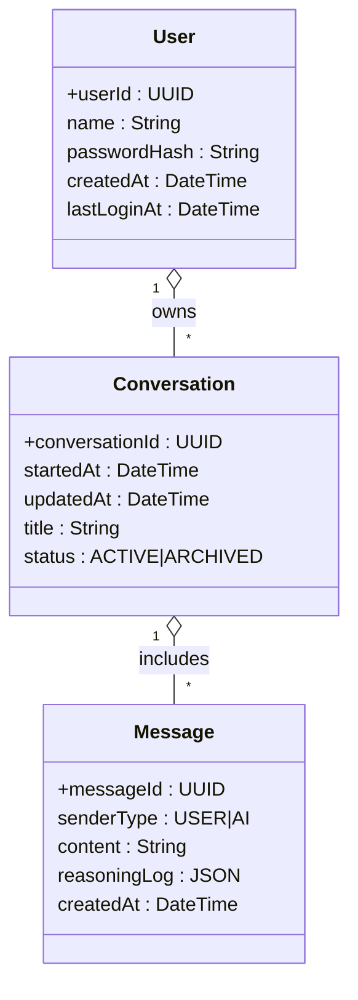

## Class Diagram

```mermaid
classDiagram
    %% ============================================================
    %% Core Domain
    %% ============================================================
    class User {
        +userId : UUID
        name : String
        passwordHash : String
        createdAt : DateTime
        lastLoginAt : DateTime
    }

    class Conversation {
        +conversationId : UUID
        startedAt : DateTime
        updatedAt : DateTime
        title : String
        status : ACTIVE\|ARCHIVED
    }

    class Message {
        +messageId : UUID
        senderType : USER\|AI
        content : String
        reasoningLog : JSON
        createdAt : DateTime
    }

    User "1" o-- "*" Conversation : owns
    Conversation "1" o-- "*" Message : includes
```
