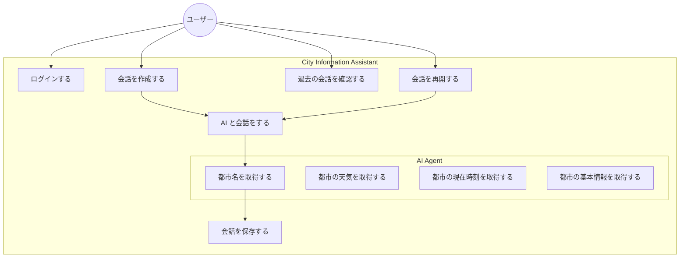

## Use Case Diagram

```mermaid
graph TB
    %% Actor
    User((ユーザー))

    %% System boundary
    subgraph "City Information Assistant"
        direction TB

        Login[ログインする]
        CreateConversation[会話を作成する]
        Chat[AI と会話をする]
        ViewHistory[過去の会話を確認する]
        ResumeConversation[会話を再開する]

        subgraph "AI Agent"
        GetCityName[都市名を取得する]
        GetCityWeather[都市の天気を取得する]
        GetCityTime[都市の現在時刻を取得する]
        GetCityInfo[都市の基本情報を取得する]
        end

        SaveConversation[会話を保存する]
    end

    %% Associations
    User --> Login
    User --> CreateConversation
    CreateConversation --> Chat
    User --> ViewHistory
    User --> ResumeConversation

    %% Include relationships
    ResumeConversation --> Chat
    Chat --> GetCityName
    GetCityName --> SaveConversation
```
